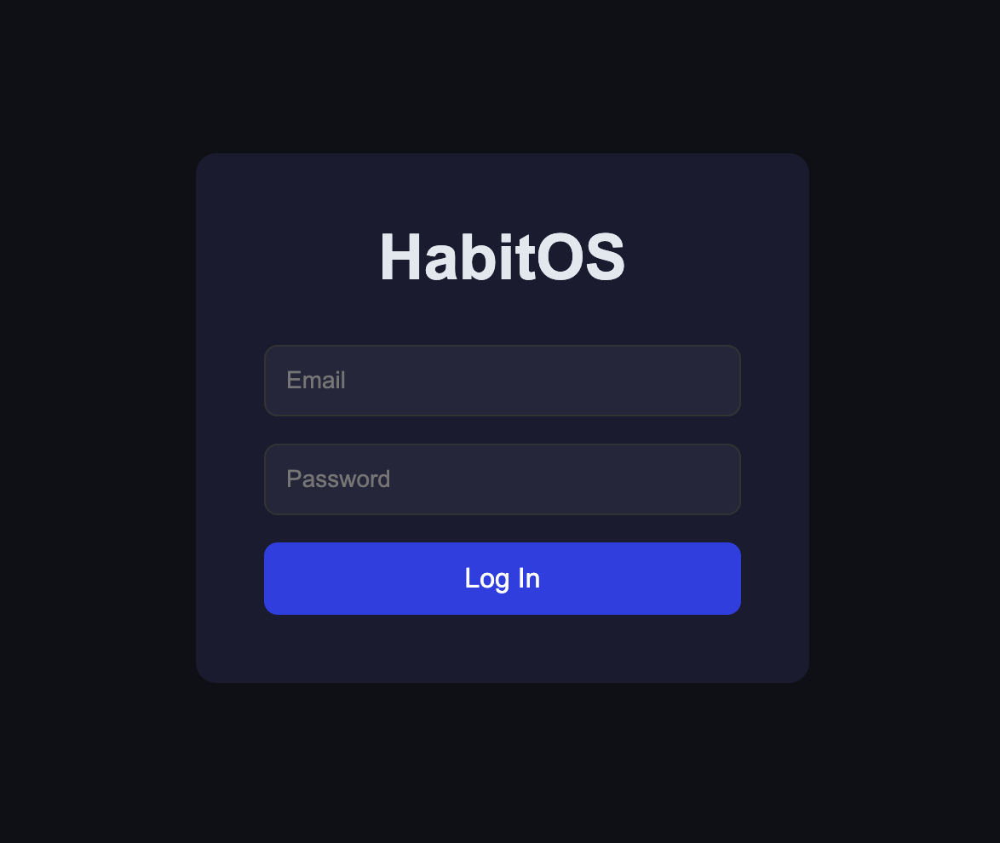
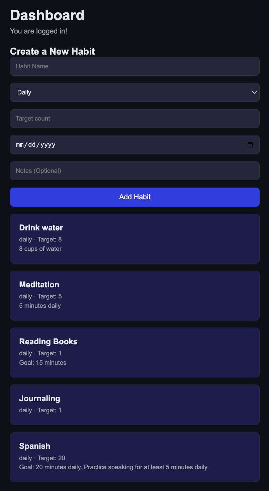

# HabitOS

HabitOS is a full-stack habit tracking app built with React, FastAPI, and PostgreSQL.
It supports managing habits and daily activity records (completions/check-ins),
with a service layer, Pydantic schemas, SQLAlchemy ORM models, Alembic 
migrations, and a pytest test suite.
The React frontend provides a login interface, 
a dashboard displaying live habit data, 
and a form for creating new habits 
which are connected to the backend via REST API calls.

> Status: Active development (v1).

<p align="center">
   
   <br>
   
</p>

---

## Why I Built This

I'm deeply interested in the intersection between computer science and psychology. 
Specifically in areas of self improvement and building small but compounding habits.
After taking Algorithm Design I at the University of Missouri, I understood C fundamentals but I hadn't built anything with a real tech stack. HabitOS was my way of building APIs, tests, a real database, and using project-based learning to simulate a real world setting.

---

## Tech Stack

- **Frontend**: React, JavaScript, HTML/CSS
- **API**: FastAPI (Python)
- **DB**: PostgreSQL
- **ORM**: SQLAlchemy
- **Migrations**: Alembic
- **Tests**: pytest (integration-style API tests)
- **Containerization**: Docker + docker-compose

---

## Getting Started
1. Create venv: `python -m venv .venv`
2. Activate: `source .venv/bin/activate`
3. Install: `pip install -r requirements.txt`
4. Run: `uvicorn app.main:app --reload`

For Docker:
```
docker-compose up -d
```
API available at `http://localhost:8000/docs`

For the frontend:
```
cd habitos-frontend
npm install
npm run dev
```
Frontend available at `http://localhost:5173`

---

## Problems I Actually Ran Into

**Alembic migration conflicts** — When I changed a model schema after already
running migrations, Alembic's state and the actual database schema fell out of 
sync. I learned to treat migration history as append-only and stopped trying to 
edit existing migration files to fix mistakes.

**Docker networking** — Getting FastAPI and PostgreSQL to communicate inside 
docker-compose meant understanding that containers are isolated. When my connection string pointed to localhost instead of the Docker service name, FastAPI couldn't reach Postgres, and the error messages pointed to the database rather than the network configuration. I learned to trace connectivity issues from the container, rather than taking error messages at face value.

**Understanding my own code** — The hardest problem isn't technical. SQLAlchemy 
sessions, Alembic's migration graph, and FastAPI's dependency injection system 
all have mental models that take time to internalize. I ended up copy-pasting patterns I didn't fully understand. 
Now, I've created a rule to not move forward on a new feature until I can explain the previous one clearly.
Sometimes that means sitting with confusion longer than feels comfortable.

**CORS and cross-origin communication** — When the React frontend first tried to reach the FastAPI backend, the browser blocked the request. 
The frontend runs on port 5173 and the backend on port 8000. 
Since they were on different ports, the browser blocked the requests by default. I fixed this by adding CORS middleware to FastAPI, but debugging it was complicated by a 500 error in the backend that hid the real issue. 
I learned to read error messages carefully and check backend code to ensure it was running correctly before fixing the connection to the frontend.

---

## What's Next
The frontend dashboard and habit creation form are complete. 
Current priorities:
1. **Habit completion toggle** — Mark habits as done for the day directly from 
   the dashboard, with visual feedback on completion status.
2. **Authentication** — JWT-based user accounts so the API can support multiple 
   users with isolated data.
3. **Analytics endpoints** — Streaks, completion rates, and date-range trend 
   queries on the dashboard.
4. **AWS deployment** — Deploy the full stack with a live HTTPS URL and custom domain.
5. **ML-based recommendations** — Pattern detection on habit completion data 
   to identify which habits correlate with streak success. The long-term goal is using 
   the habit data to spot behavioral patterns, connecting to my interest in neuroscience 
   and behavioral AI.
