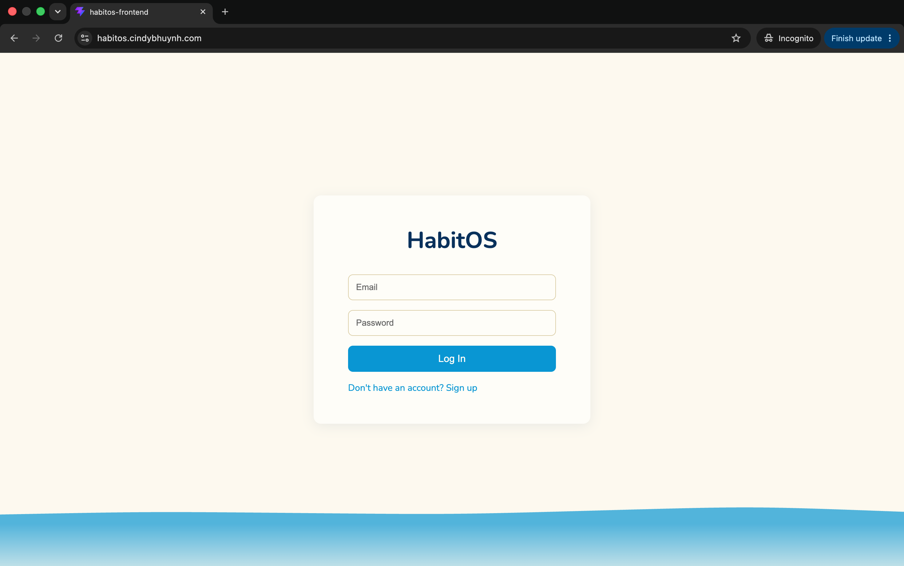
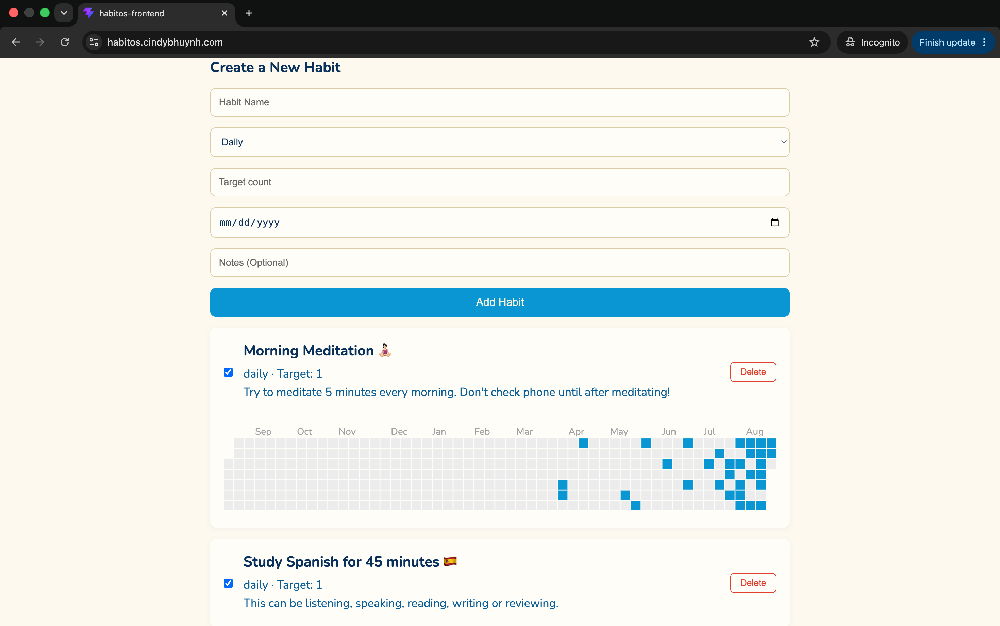
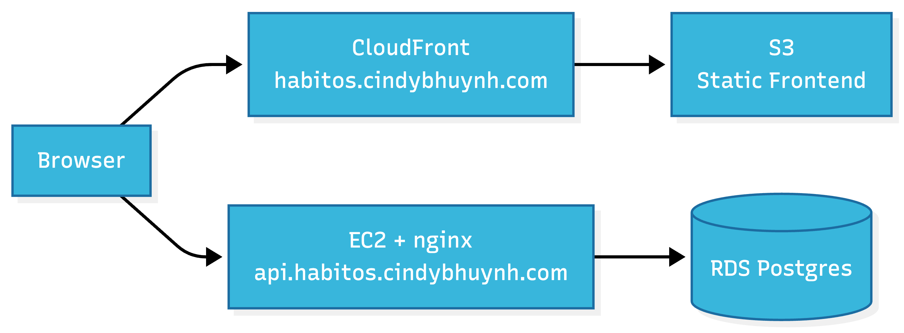

# HabitOS

A full-stack habit tracker with calendar heatmaps for visualizing consistency over time.

**Live Demo:** [habitos.cindybhuynh.com](https://habitos.cindybhuynh.com)  
**Repository:** [github.com/cindybhuynh/habit-os](https://github.com/cindybhuynh/habit-os)


<p align="center">
  
  <br>
  <em>Authentication — Minimalist interface with dynamic wave canvas</em>
</p>


## Overview

HabitOS lets users create daily and weekly habits, toggle completions, and see their consistency over the past year through calendar heatmaps.


## Why I Built This ✨

I’m fascinated by the intersection of computer science and psychology. In particular, the small, compounding habits that shape our daily lives. 

I wanted to bridge that curiosity with a complete, end-to-end engineering workflow. Building HabitOS from an initial blank commit to a live AWS deployment allowed me to design a system from start to finish: making intentional architectural decisions, enforcing API security, and shipping an interactive tool that people can genuinely use every day.

<p align="center">
  
  <br>
  <em>Dashboard — Interactive year-long completion heatmaps</em>
</p>


## Core Features ⭐️

* **Habits and completions:** Users can create daily or weekly habits, toggle completions, add optional notes, and delete habits with confirmation.
* **Per-Habit Heatmaps:** Year-long completion heatmaps powered by custom CSS and `react-calendar-heatmap`.
* **State Management:** Centralized `apiFetch` wrapper attaches JWT tokens and handles expired sessions by redirecting to login.
* **Design System:** Single-family typography (`Nunito`) paired with an ocean/sunset palette derived from personal film photography.

## Tech Stack 

| Layer | Technologies |
| :--- | :--- |
| **Frontend** | React (Vite), react-calendar-heatmap, react-wavify |
| **Backend API** | FastAPI (Python), SQLAlchemy, Alembic, python-jose (JWT), pytest |
| **Database** | PostgreSQL 17 (AWS RDS) |
| **Infrastructure** | AWS (EC2, S3, CloudFront, ACM), Cloudflare (DNS + Registrar), Let's Encrypt (nginx SSL), GitHub Actions CI/CD |

## Architecture Diagram
<p align="center">
  
  <br>
  <em>Architecture Diagram — Technology Stack</em>
</p>

## Architectural Decisions

* **Ownership through parent relationships:** `HabitCompletion` records don't store their own `user_id`. Ownership is verified once through the parent habit, and queries scoped to `habit_id` are automatically scoped to the correct user. This is cleaner and prevents over-filtering bugs.

* **404 instead of 403 for cross-user access:** When a user tries to access another user's habits, the API returns a 404 error instead of a 403 error. A 403 error would leak that the data exists but isn't theirs.

* **Same error for missing user vs wrong password:** Identical error responses prevent attackers from enumerating registered emails.

* **JWT algorithm allowlist:** `jwt.decode()` is called with `algorithms=["HS256"]` as an explicit list, blocking algorithm-substitution attacks like `alg: none`.

* **Real Postgres in CI:** GitHub Actions runs pytest against a real Postgres 17 service container, not SQLite. Catches version-specific behavior differences that SQLite would silently mask.

## Running Locally 
**Backend:**
```bash
# Clone and enter repository
git clone https://github.com/cindybhuynh/habit-os.git
cd habit-os

# Create and activate virtual environment
python -m venv .venv
source .venv/bin/activate  # On Windows: .venv\Scripts\activate

# Install dependencies and start server
pip install -r requirements.txt
uvicorn app.main:app --reload
```
API at `http://localhost:8000/docs`

**Frontend:**
```bash
cd habitos-frontend
npm install
npm run dev
```

Frontend at `http://localhost:5173`

## Built By 🎆
* **Cindy Huynh** — Computer Science Student, University of Missouri
* [LinkedIn](https://www.linkedin.com/in/cindybhuynh) • [GitHub](https://github.com/cindybhuynh)

## License
This project is licensed under the MIT License — see the [LICENSE](LICENSE) file for details.
